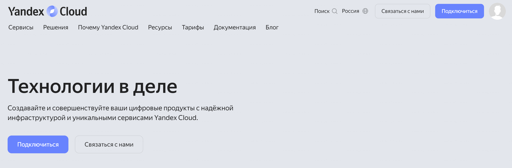
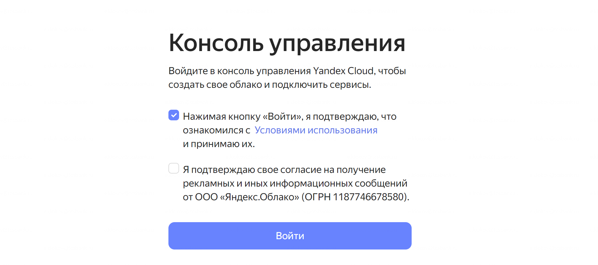

# **yandex-iot-core-alice**
Smart home Yandex backend based on Yandex cloud function and ESP8266 (ESP32)

# Yandex.Cloud

Для начала нужно настроить окружение в Yandex.Cloud, для этого идем на https://cloud.yandex.ru/ и в верхнем правом углу жмем **Подключиться**



на следующем экране подтверждаем ознакомление с условиями использования, и жмем **Войти**



после этого создается наше облако

### Платежный аккаунт

Для работы в облаке Yandex необходим платежный аккаунт, по-этому сразу на главной видим баннер:


В платежном аккаунте требуется привязать карту. Это формальность и данное решение будет полностью бесплатным. По-этому жмем **Создать аккаунт** и заполняем все необходимое. Для привязки карты потребуется списание 11 рублей, после привязки эти деньги вернутся на счет.

## MQTT брокер

TODO 

# Arduino IDE
http://arduino.esp8266.com/stable/package_esp8266com_index.json


## работа с ESP8266 через Yandex IoT Core MQTT
- создание брокера в yandex cloud
- настройка скетча


### Device CFG
В папке со скетчем для Arduino нужно создаться файл `cfg.h`, и в нем прописать нужные параметры
```c
// WiFi client settings.
const char *_ssid = "";     // WiFi SSID.
const char *_password = ""; // WiFi password.
// Yandex CLOUD.
const char *_username = "";         // Yandex IoT broker ID.
const char *_devicepassword = "";   // Yandex IoT broker password.
```

- проверка через Yandex Cli


## Yandex Cloud Function

Для бекэнда навыка умного дома в этом проекте используется Yandex Cloud Funсtion на языке Python.

### авторизация через Я.ID

В отличии от навыков Алисы, навыки умного дома требуют авторизацию по протоколу oauth 2.0. Для личного использования можно воспользоваться [Я.ID](https://oauth.yandex.ru). 

Переходим, логинимся и создаем новое приложение. Внизу, где раздел **Какие данные вам нужны?** ищем раздел **Умный дом Яндекса • iot** и ставим галочки

```
- Просмотр списка устройств умного дома
- Управление устройствами умного дома
```

### создание навыка умного дома

Далее идем в консоль разработчика [Яндекс Диалоги](https://dialogs.yandex.ru/developer) 

выбираем **Создать диалог** и выбираем Умный дом и заполняем настройки:
- Название: пишем как будет называться наш умный дом
- Backend: выбираем Функция в Яндекс Облаке и раскрывающемся списке ниже выбираем функцию, которую мы создавали выше
- Тип доступа: выбираем Приватный. Это позволит только нам активировать данный навык и его не нужно будет модерировать

Далее ниже заполняем все обязательные поля на свое усмотрение, сохраняемся и переходим на вкладку **Связка аккаунтов** и заполняем следующие поля

- Идентификатор приложения: это Client ID приложения которое мы создавали в [Я.ID](https://oauth.yandex.ru)
- Секрет приложения: так же берем из [Я.ID](https://oauth.yandex.ru)
- URL авторизации: `https://oauth.yandex.ru/authorize`
- URL для получения токена: `https://oauth.yandex.ru/token`

### Tестирование

В этом разделе можно имитировать работу приложения. В верхнем правом углу жмем плюс и выбираем Устройства умного дома. В списке производителей будет только наш навык, добавляем его и жмем обновить список устройств.

Если все предыдущие пункты выполнены, то в списке устройств появится NodeMCU, добавляем его. 

Дальше можно то же самое можно провернуть в приложении Умный дом от Яндекс и пробовать управлять голосом.